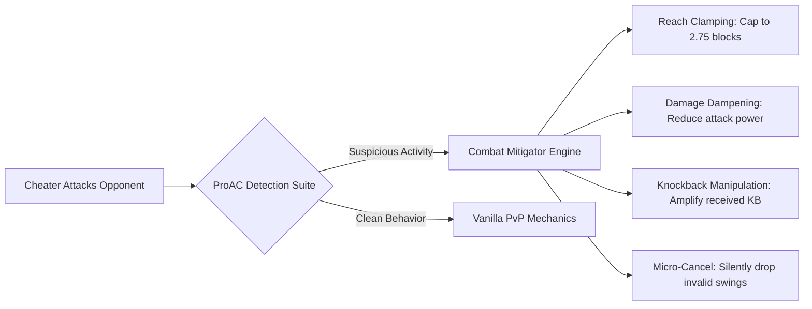

<div align="center">

# 🛡️ ProAnticheat (ProAC)

**Enterprise-Grade Server-Side Anticheat & Predictive Simulation Suite for Minecraft**

[](#supported-platforms)
[](#supported-platforms)
[](#core-architectural-pillars)
[](#closed-source--licensing-notice)
[](#cross-proxy--enterprise-network-synchronization)

<br>

<p align="center">
  <a href="#overview">Overview</a> •
  <a href="#core-architectural-pillars">Key Features</a> •
  <a href="#silent-combat-mitigation-shadow-nerf">Silent Mitigation</a> •
  <a href="#detection-matrix">Detections</a> •
  <a href="#commands--permissions">Commands</a> •
  <a href="#database-drivers--scalability">Storage</a> •
  <a href="#developer-api">API</a> •
  <a href="#installation--requirements">Installation</a>
</p>

---

</div>

## 📌 Overview

**ProAnticheat (ProAC)** is an industry-leading, high-performance server-side anticheat solution engineered specifically for competitive Minecraft networks, practice servers, and massive survival ecosystems.

By fusing **deterministic 1:1 server-side physics simulation** with **advanced statistical information theory (Shannon Entropy, Kurtosis, Skewness)** and **silent combat mitigation ("Shadow-Nerfing")**, ProAC delivers unprecedented detection accuracy while maintaining a strict **zero false-positive** standard.

> [!IMPORTANT]
> ### 🔒 Closed-Source & Licensing Notice
> This repository serves as the public documentation, issue tracker, release channel, and developer integration hub for **ProAC**.
> 
> The underlying source code of ProAC is proprietary and maintained in a private repository. Keeping detection formulas, statistical thresholds, sensitivity normalizers, and mitigation models closed-source is a deliberate security decision to prevent cheat developers from analyzing and engineering direct bypasses.
> 
> For licensing, enterprise access, or private partnership inquiries, please contact our team via [Discord](#support--community) or email.

---

## ⚡ Core Architectural Pillars

### 1. Deterministic 1:1 Physics Simulation Core
Traditional anticheats rely on simplistic distance limits and delta checks, resulting in endless false positives during latency spikes or complex world mechanics.
* **Full Server-Side Physics Simulation**: Simulates the exact client-side movement tick-by-tick, factoring in gravity, friction, block hitboxes, potion effects, inertia, fluids, soul sand, and cobwebs.
* **Latency & Transaction Tick Alignment**: Every player movement packet is aligned against server transaction ticks, reconciling network latency without sacrificing detection speed.
* **Zero False-Positive Setback Engine**: Setback buffers and predictive error thresholds ensure legitimate players are never hindered by lag spikes or desynchronization.

### 2. Information-Theory & Higher-Order Statistical Click Analysis
Modern autoclickers no longer click at static intervals; they mimic human jitter with Gaussian noise, artificial micro-pauses, and randomized variance. ProAC eliminates humanized clickers using advanced mathematical analysis:
* **Shannon Entropy (`ClickEntropy`)**: Computes the true information entropy $H(X)$ of click intervals, distinguishing organic biological variance from pseudo-random algorithmic distributions.
* **Kurtosis Analysis (`ClickKurtosis`)**: Measures the "tailedness" and flattening of the interval probability distribution.
* **Skewness & Symmetry (`ClickSkewness`)**: Analyzes the third standardized moment to detect asymmetric debounce macros and double-click hardware emulations.
* **Variance & Consistency (`ClickDeviation`, `ClickConsistency`)**: Multi-window sample variance tracking to identify long-term artificial consistency and macro loops.
* **CPS Guard (`ClickSpeedLimiter`)**: Hard-ceiling enforcement preventing inhuman burst speeds.

### 3. Polar & Intave-Grade Aim Analytics
* **Mouse Sensitivity Normalization (`AimSensitivity`)**: Reconstructs rotation deltas against Minecraft’s internal mouse sensitivity divisor (GCD - Greatest Common Divisor). Movements that deviate from valid mechanical steps are immediately flagged.
* **Third Angular Derivative (`AimJerk`)**: Analyzes the jerk (rate of change of angular acceleration) to detect abrupt algorithmic targeting and "snap-and-revert" (LazyFlick) aim modifications.
* **Sub-Tick Micro-Snaps (`AimSnap`)**: Detects micro-snaps that align perfectly with the exact tick an attack packet is dispatched (Silent Aimbot & AimAssist).
* **Standard Deviation Modeling (`AimStandardDeviation`)**: Detects unnaturally low variation across angular sweeps typical of linear/smooth aimbots.

### 4. Dynamic Entity Baiting (`BaitBot`)
* Spawns non-intrusive, virtual bait entities into the suspect's packet stream.
* Catches 100% of headless KillAuras, multi-target rotations, and silent aim vectors with indisputable mathematical certainty.

### 5. Multi-Tick Raytraced Reach & BackTrack Detection
* **Millimeter-Precision Raytracing**: Calculates exact ray-to-box intersections against historical player bounding boxes, factoring in client interpolation and ping compensation.
* **BackTrack Detection (`BackTrack`)**: Identifies players abusing artificial ping-spoof buffers to hit enemies at outdated positions.
* **Hitbox Expansion Defense**: Prevents attacks outside the vanilla 3.0-block reach threshold under all network conditions.

### 6. Scaffolding & World Placement Verification
* **Angle Lock Prevention (`AngleSnap`)**: Identifies players locking yaw/pitch to 45° or 90° intervals while godbridging or diagonal bridging.
* **Placement Geometry (`AirLiquidPlace`, `FabricatedPlace`, `PositionPlace`, `RotationPlace`)**: Enforces realistic eye-to-face line of sight, raycast contact points, and eliminates placements in mid-air or through solid walls.
* **Mining Verification (`FastBreak`)**: Validates block break progression and mining speeds packet-by-packet.

---

## 🥷 Silent Combat Mitigation (Shadow-Nerf)

Rather than abruptly banning cheaters and immediately notifying cheat creators of detection vectors, ProAC features a configurable **Silent Combat Mitigation** engine ("Shadow-Nerf"):



* **Dynamic Reach Clamping**: Silently restricts a flagged player's combat reach down to **2.75 blocks** (below vanilla reach), putting the cheater at a distinct disadvantage.
* **Damage Dampening**: Dynamically attenuates outgoing damage without showing any errors or desync messages.
* **Knockback Vector Manipulation**: Increases knockback taken by the cheater while dampening the knockback they deal to legitimate opponents.
* **Micro-Cancellations**: Drops illegitimate attack packets at the network layer without triggering client desync or kick screens.

---

## 📊 Detection Matrix

| Category | Check | Detection Type | Description |
| :--- | :--- | :---: | :--- |
| **Combat** | `Reach` | Deterministic | Raytraced 3.0-block reach verification with latency compensation. |
| **Combat** | `KillAura` | Deterministic | Impossible attack vectors, head movement inconsistencies, and multi-entity hits. |
| **Combat** | `BaitBot` | Virtual Trap | Injected packet bait entities for 100% indisputable KillAura confirmation. |
| **Combat** | `BackTrack` | Heuristic | Hitting outdated historical bounding boxes via artificial lag spoofing. |
| **Combat** | `Hitboxes` | Deterministic | Expanding bounding boxes and out-of-bounds entity interactions. |
| **Combat** | `MultiInteract` | Packet | Attacking multiple entities within an impossible micro-tick window. |
| **Autoclicker** | `ClickEntropy` | Statistical | Shannon Entropy analysis distinguishing human randomness from RNG algorithms. |
| **Autoclicker** | `ClickKurtosis` | Statistical | Fourth-moment probability distribution analysis detecting flattened click profiles. |
| **Autoclicker** | `ClickDeviation` | Statistical | Standard deviation analysis over multiple rolling click windows. |
| **Autoclicker** | `ClickConsistency`| Statistical | Identification of repetitive millisecond intervals and hardware macro patterns. |
| **Autoclicker** | `ClickSkewness` | Statistical | Third standardized moment tracking asymmetric debounce / butterfly macro curves. |
| **Autoclicker** | `ClickSpeedLimiter`| Hard Limit | Hard CPS ceiling enforcer. |
| **Aim** | `AimSensitivity` | Heuristic | Mouse sensitivity GCD (Greatest Common Divisor) normalization. |
| **Aim** | `AimJerk` | Mathematical | 3rd angular derivative evaluation for snap-and-revert (LazyFlick) movements. |
| **Aim** | `AimSnap` | Heuristic | Sub-tick micro-snapping to target hitboxes on attack execution ticks. |
| **Aim** | `AimStandardDeviation`| Statistical | Smooth aimbot variance profiling and constant velocity sweep detection. |
| **Aim** | `AimDuplicateLook`| Packet | Identical floating-point angle duplicates indicative of external overlays. |
| **Movement** | `PredictionRunner` | Simulation | 1:1 server-side physics prediction for walking, jumping, sprinting, and sneaking. |
| **Movement** | `NoSlow` | Simulation | Enforces slowdown penalties while eating, drawing bows, blocking, or sneaking. |
| **Movement** | `Knockback` | Simulation | Full physics modeling of player attack knockback vectors. |
| **Movement** | `Explosion` | Simulation | Vector modeling of explosion velocity and environmental recoil. |
| **Movement** | `Phase` | Simulation | Blocks walking through walls, closed doors, and solid geometry. |
| **Placement** | `AngleSnap` | Heuristic | 45°/90° angle locking detection used in diagonal scaffold bridgers. |
| **Placement** | `AirLiquidPlace` | Geometric | Prevents placing blocks against air or liquid without valid support. |
| **Placement** | `FabricatedPlace`| Raycast | Verifies cursor raycasts and block face contact coordinates. |
| **Network** | `TimerA` / `Negative`| Clock Sync | Packet clock drift analysis detecting game speedups, tick freeze, and fake lag. |
| **Network** | `InventoryOnMove`| State Check | Interacting with containers and inventories while sprinting or moving. |
| **Network** | `BadPackets` | Protocol | Structural packet ordering violations, duplicate packets, and crash vectors. |

---

## 💻 Commands & Permissions

ProAC provides a rich suite of administrative commands with permission support:

| Command | Permission | Description |
| :--- | :--- | :--- |
| `/proac alerts` | `proac.alerts` | Toggle real-time in-game staff alerts. |
| `/proac verbose` | `proac.verbose` | Toggle raw telemetry and verbose check data feed. |
| `/proac spectate <player>` | `proac.spectate` | Enter stealth spectator mode (concealed from cheat radars). |
| `/proac stopspectating` | `proac.spectate` | Return from spectator mode to your original position. |
| `/proac profile <player>` | `proac.admin` | View player ping, client brand, protocol version, and flag counts. |
| `/proac history <player>` | `proac.history` | Query persistent violation logs from the database. |
| `/proac historymigrate` | `proac.admin` | Migrate player violation logs between storage engines. |
| `/proac brands` | `proac.brands` | Toggle notifications when players join with modified/blacklisted clients. |
| `/proac list` | `proac.alerts` | Display all currently flagged or suspicious players on the server. |
| `/proac log` | `proac.admin` | Upload diagnostic data and telemetry to a private pastebin log. |
| `/proac dump <player>` | `proac.admin` | Dump active player state and movement prediction buffers. |
| `/proac perf` | `proac.admin` | Monitor ProAC thread timings, memory footprint, and tick load. |
| `/proac reload` | `proac.admin` | Hot-reload configurations and module weights without server restarts. |
| `/proac testwebhook` | `proac.admin` | Dispatch a test embed to your configured Discord Webhook. |

---

## 🗄️ Database Drivers & Scalability

ProAC is built from the ground up for high-traffic networks. It features **6 pluggable, non-blocking storage backends**:

```
proac/
├── MongoDB     (Enterprise multi-datacenter clusters)
├── PostgreSQL  (Relational enterprise database)
├── MySQL       (High performance SQL storage)
├── Redis       (Ultra-fast in-memory caching & cross-network sync)
├── SQLite      (Lightweight, zero-setup local storage)
└── In-Memory   (Volatile, zero-disk footprint mode)
```

Use `/proac historymigrate <from> <to>` to migrate millions of logs across engines on-the-fly with zero downtime.

---

## 🌐 Cross-Proxy & Enterprise Network Synchronization

* **BungeeCord & Velocity Messaging Bridges**: Forward violation alerts across multiple proxy instances to keep staff coordinated network-wide.
* **Malicious Client Filtering**: Automatically detects client brands (`LunarClient`, `Feather`, `Vanilla`, etc.) and isolates or kicks blacklisted Forge releases (e.g., versions prone to reach modification exploits).
* **Folia Support**: Fully compatible with Folia's regional threading architecture; packet listeners run completely detached from server tick loops.

---

## 🎨 Staff Experience & Discord Integration

* **Interactive In-Game Alerts**: Full MiniMessage and RGB color support. Hover over any alert to view the exact check description, violation level (VL), and confidence score; click to instantly teleport to the suspect.
* **Stealth Spectator Mode**: Prevents cheat radar modifications from detecting monitoring staff members by properly masking their presence in packet streams.
* **Rich Discord Webhooks**: Instant, formatted Discord embeds with player avatars, ping, check breakdown, and direct logs.

---

## 🧩 Developer API

ProAC includes a developer API (`ProAPI` / `ProExternalAPI`) and an event bus to build custom addons or integrate with punishment management plugins:

### Gradle Dependency
```kotlin
repositories {
    maven("https://repo.yourdomain.com/releases")
}

dependencies {
    compileOnly("pro.proac:proac-api:2.0.0")
}
```

### Event Listening Example
```java
import net.proac.api.event.ProACFlagEvent;
import net.proac.api.event.ProACPunishEvent;
import org.bukkit.event.EventHandler;
import org.bukkit.event.Listener;

public class AnticheatListener implements Listener {

    @EventHandler
    public void onFlag(ProACFlagEvent event) {
        String player = event.getPlayer().getName();
        String checkName = event.getCheck().getName();
        int vl = event.getViolationLevel();

        // Custom logging or staff integration
    }

    @EventHandler
    public void onPunish(ProACPunishEvent event) {
        if (event.getPlayer().hasPermission("network.bypass")) {
            event.setCancelled(true);
            return;
        }
        
        // Custom punishment command or broadcast
        System.out.println("Executing punishment: " + event.getCommand());
    }
}
```

---

## 🚀 Installation & Requirements

### System Requirements
* **Java**: Java 17 or Java 21+ (recommended)
* **Server Software**:
  * Paper, Purpur, Pufferfish, Folia (1.8.8 – 1.21.x+)
  * Fabric (with Fabric API)
* **Memory**: Minimal footprint (~25MB heap overhead under active load)

### Quick Start
1. Place the compiled `ProAC.jar` into your server's `plugins/` (or `mods/` for Fabric) directory.
2. If running across a network, ensure **PacketEvents** / protocol dependencies are configured if applicable.
3. Start the server to generate configuration files in `plugins/ProAC/`.
4. Edit `config.yml` to select your preferred database driver, configure alert formats, and set up your Discord webhook URL.
5. Use `/proac reload` to apply configuration changes live.

> **Proxy Networks (BungeeCord / Velocity)**:
> * Install ProAC directly on the **backend game servers**.
> * If using **ViaVersion**, it must run on the backend game servers for accurate protocol translations.
> * Enable `proxy.send` and `proxy.receive` in `config.yml` to broadcast alerts across your network.

---

## ❓ Frequently Asked Questions (FAQ)

<details>
<summary><strong>Why is ProAC closed source?</strong></summary>

ProAC’s statistical models, Shannon entropy thresholds, and physics simulation algorithms represent proprietary research. Open-sourcing detection code allows cheat developers to test against exact thresholds and automate bypasses. Keeping it closed-source guarantees that cheat clients cannot easily predict or circumvent the detection pipeline.
</details>

<details>
<summary><strong>Does ProAC cause server lag or drop TPS?</strong></summary>

No. ProAC operates almost entirely asynchronously on Netty network worker threads. Physics predictions and statistical calculations are performed outside the main Minecraft server tick loop, ensuring stable 20.0 TPS even during high-CPS PvP combat.
</details>

<details>
<summary><strong>How does Silent Mitigation differ from instant bans?</strong></summary>

Instant bans or aggressive setbacks inform cheat developers and players that their cheat was detected, allowing them to adjust settings immediately. Silent Mitigation ("Shadow-Nerfing") keeps the cheater in the dark: their reach is clamped, their damage is lowered, and their knockback is neutralized, rendering their cheats ineffective while keeping your server free from disruptions.
</details>

---

## 💬 Support & Community

* **Private Discord**: [Join our Discord](https://discord.gg/QeDcCFXDVa) *(Open a ticket for license verification)*
* **Issue Tracker**: Submit bug reports and feature requests open ticket on discord
* **Enterprise Licensing**: Contact discord `[sales@yourdomain.com](https://discord.gg/QeDcCFXDVa)` for multi-network enterprise agreements.

<div align="center">
  <br>
  <sub>Copyright © 2024–2026 ProAnticheat Suite. All rights reserved.</sub>
</div>
