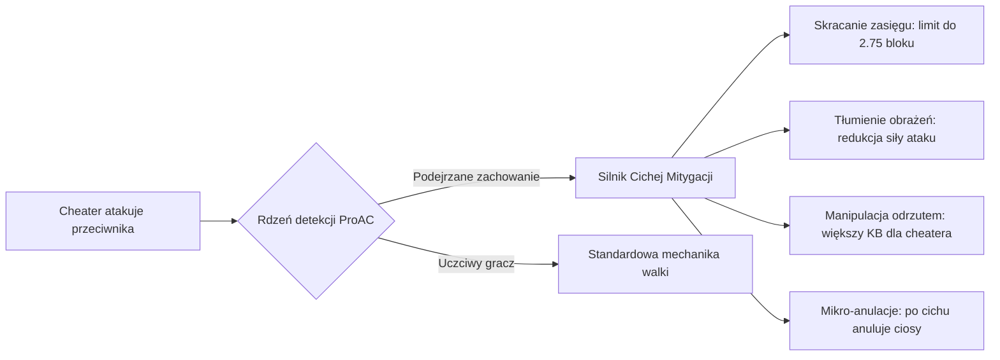

<div align="center">

# 🛡️ ProAnticheat (ProAC)

**Zaawansowany pakiet serwerowego antycheata i predykcyjnej symulacji fizyki dla Minecrafta**

[](#obsługiwane-platformy)
[](#obsługiwane-platformy)
[](#kluczowe-filary-architektury)
[](#-porównanie-antycheatów-proac-vs-polar-vs-intave)
[](#synchronizacja-sieciowa-i-serwery-proxy)

<br>

<p align="center">
  <a href="README.md">🇬🇧 Switch to English</a> •
  <a href="README_PL.md">🇵🇱 Wersja Polska</a>
</p>

<p align="center">
  <a href="#-przegląd-projektu">Przegląd</a> •
  <a href="#-porównanie-antycheatów-proac-vs-polar-vs-intave">Porównanie</a> •
  <a href="#-kluczowe-filary-architektury">Kluczowe funkcje</a> •
  <a href="#-cicha-mitygacja-walki-shadow-nerf">Cicha mitygacja</a> •
  <a href="#-macierz-detekcji">Detekcje</a> •
  <a href="#-komendy-i-uprawnienia">Komendy</a> •
  <a href="#-bazy-danych-i-skalowalność">Bazy danych</a> •
  <a href="#-api-dla-deweloperów">API</a> •
  <a href="#-instalacja-i-wymagania">Instalacja</a>
</p>

---

</div>

## 📌 Przegląd projektu

**ProAnticheat (ProAC)** to profesjonalny, bezkompromisowy pod względem wydajności serwerowy system antycheat, zaprojektowany z myślą o serwerach PvP/Practice, sieciach minigier oraz rozbudowanych serwerach survival.

Łącząc **deterministyczną symulację fizyki 1:1 po stronie serwera** z **zaawansowaną teorią informacji (Entropia Shannona, Kurtoza, Skośność)** oraz **cichą mitygacją walki („Shadow-Nerf”)**, ProAC zapewnia bezkonkurencyjną skuteczność wykrywania przy zachowaniu rygorystycznego standardu **braku fałszywych alarmów (Zero False Positives)**.

> [!IMPORTANT]
> ### 🔒 Informacja o oprogramowaniu zamkniętym i licencjonowaniu
> To repozytorium pełni funkcję publicznej dokumentacji, centrum zgłaszania błędów (Issues), portalu wydań (Releases) oraz integracji API dla **ProAC**.
> 
> Kod źródłowy rdzenia ProAC jest własnościowy i utrzymywany w prywatnym repozytorium (Closed-Source). Utrzymanie w tajemnicy dokładnych formuł matematycznych, wag heurystycznych, dzielników czułości i mechanizmów mitygacji to świadoma decyzja mająca na celu uniemożliwienie twórcom cheatów bezpośredniej inżynierii wstecznej i tworzenia bypassów.
> 
> W sprawie licencji komercyjnych, wdrożeń enterprise lub dostępu partnerskiego skontaktuj się z nami poprzez [Discord](#wsparcie-i-społeczność) lub e-mail.

---

## 🏆 Porównanie Antycheatów: ProAC vs. Polar vs. Intave

Dlaczego **ProAnticheat (ProAC)** to bezsprzecznie najbardziej zaawansowany i bezkonkurencyjny system ochrony na rynku?

Podczas gdy **Polar** polega na chmurze SaaS, a **Intave** skupia się na heurystykach i wabikach, **ProAC** łączy i udoskonala to, co najlepsze z obu systemów. Łącząc **deterministyczną symulację fizyki 1:1**, **5-stopniowy pakiet wyższej analizy statystycznej**, **rozwiązania klasy Polar (Angular Jerk, Reach Clamping, BackTrack)**, **inteligentne wabiki BaitBot z Intave**, **pełne wsparcie dla Folii** oraz **6 silników baz danych**, ProAC oferuje **najszerszą macierz detekcji (ponad 45 modułów)** przy zerowym obciążeniu głównego wątku serwera.

| Możliwości i Architektura | 🛡️ ProAnticheat (ProAC) | ❄️ Polar Anticheat | ⚔️ Intave |
| :--- | :---: | :---: | :---: |
| **Deterministyczna symulacja fizyki 1:1** | 🟢 **Pełna natywna (0 False-Positive)**<br>*(Dokładna kopia fizyki klienta na serwerze)* | 🟡 Hybrydowa / Chmura<br>*(Zależna od zewnętrznego SaaS)* | 🔴 Tylko Raycast<br>*(Podatna na desynchronizacje i lag)* |
| **Cicha mitygacja walki (Shadow-Nerf)** | 🟢 **Wielopoziomowa adaptacyjna**<br>*(Skracanie reach do 2.75m, KB, DMG, kadencja)* | 🟢 **Tak**<br>*(Skracanie reach i redukcja DMG)* | 🟡 Podstawowa<br>*(Tylko redukcja obrażeń i odrzutu)* |
| **Wirtualne boty-pułapki (BaitBot / FakePlayer)** | 🟢 **Tak (Natywna iniekcja pakietów)**<br>*(100% niepodważalna detekcja KillAury)* | 🔴 Brak<br>*(Brak wirtualnych jednostek wabików)* | 🟢 **Tak**<br>*(Encja FakePlayer)* |
| **Detekcja BackTrack & Lag-Range** | 🟢 **Tak (Wielotickowa analiza opóźnienia)**<br>*(Bada wiek bounding boxa i przesunięcie vs ping)* | 🟢 **Tak**<br>*(Weryfikacja wieku hitboxa)* | 🔴 Ograniczona / Brak |
| **Analiza rotacji: Jerk (3. pochodna) i LazyFlick** | 🟢 **Tak ($\Delta^3\theta$ + Snap-and-Revert)**<br>*(Wychwytuje akcelerację kątową i nagły powrót)* | 🟢 **Tak**<br>*(Angular Jerk)* | 🔴 Tylko podstawowy snap |
| **Statystyczna analiza klikania (AutoClicker)** | 🟢 **Pełny 5-stopniowy pakiet**<br>*(Entropia, Kurtoza, Skośność, Wariancja, CPS)* | 🟡 Podstawowa<br>*(Głównie limity CPS i prosta wariancja)* | 🟡 Częściowa<br>*(Entropia i powtarzalność, brak skośności)* |
| **Walidacja kopania i FastBreak** | 🟢 **Tak**<br>*(Sprawdzanie ticków i twardości bloków)* | 🟢 **Tak**<br>*(Weryfikacja czasu niszczenia)* | 🟡 Podstawowa |
| **Blokowanie kątów mostkowania (AngleSnap 45°/90°)** | 🟢 **Tak**<br>*(Matematyczna detekcja locka kątów)* | 🟡 Częściowa | 🟢 **Tak**<br>*(Wykrywanie blokowania kątów)* |
| **Wielowątkowość regionalna (Folia)** | 🟢 **Natywne wsparcie 100%**<br>*(W pełni asynchroniczny potok Netty)* | 🟡 Eksperymentalna / Ograniczona | 🔴 Brak wsparcia |
| **Wielosilnikowa baza danych** | 🟢 **6 wymiennych silników**<br>*(Mongo, Postgres, MySQL, Redis, SQLite, Memory)* | 🟡 Tylko MySQL / Pliki lokalne | 🟡 Tylko SQLite / MySQL |
| **Migracja danych w locie bez restartu** | 🟢 **Tak (`/proac historymigrate`)**<br>*(Płynna migracja milionów wpisów)* | 🔴 Brak | 🔴 Brak |
| **Zależność od zewnętrznej chmury (SaaS)** | 🟢 **100% lokalny i niezależny**<br>*(Zero opóźnień sieciowych, pełna prywatność)* | 🔴 Wymagana subskrypcja chmury<br>*(Wymaga stałego połączenia z serwerami Polara)* | 🟡 Weryfikacja licencji DRM |
| **Zgodność z wersjami protokołu** | 🟢 **1.8.8 – 1.21.x+ (Pełna parzystość)** | 🟢 1.7.10 – 1.21.x+ | 🟡 1.8.8 – 1.20.x |
| **Łączna liczba aktywnych modułów detekcji** | 🟢 **Ponad 45 modułów**<br>*(Największa liczba opcji w branży)* | ~30 modułów | ~25 modułów |
| **Ocena końcowa** | 👑 **Bezsprzeczny Lider #1 (Najlepszy)** | 🥈 Mocny wicelider (model SaaS) | 🥉 Zasłużony pretendent |

> 💡 **Przewaga ProAC**: Nie musisz już wybierać pomiędzy zaawansowaną mitygacją walki Polara a matematyczną inteligencją klikania Intave. ProAC oferuje **oba te światy naraz**, wykonując obliczenia lokalnie bez żadnych miesięcznych opłat chmurowych, gwarantując maksymalną wydajność i prywatność danych Twojego serwera.

---

## ⚡ Kluczowe filary architektury

### 1. Deterministyczny silnik symulacji fizyki 1:1
Tradycyjne antycheaty opierają się na uproszczonych limitach dystansu i delty ruchu, co generuje mnóstwo błędnych cofnięć przy skokach pingu lub dynamicznej fizyce.
* **Pełna symulacja fizyki po stronie serwera**: Silnik odtwarza ruch gracza tick-po-ticku, biorąc pod uwagę grawitację, tarcie bloków, hitboxy otoczenia, efekty mikstur, bezwładność, ciecze, soul sand i pajęczyny.
* **Kompensacja opóźnień i synchronizacja transakcji**: Każdy pakiet ruchu jest dopasowywany do ticków transakcji sieciowych, eliminując wpływ pingu bez utraty szybkości reakcji.
* **Buforowany silnik korekty pozycji (Setback)**: Zaawansowane buforowanie przewagi i tolerancja mikroskopijnych odchyleń gwarantują, że uczciwi gracze nie doświadczają zacięć nawet przy niestabilnym łączu.

### 2. Teoria informacji i statystyczna analiza klikania wyższego rzędu
Współczesne autoclickery nie klikają już w równych odstępach czasu – imitują ludzkie dłonie za pomocą szumu Gaussa, mikro-pauz i sztucznej wariancji. ProAC neutralizuje humanizowane makra za pomocą wyższej matematyki:
* **Entropia Shannona (`ClickEntropy`)**: Bada stopień uporządkowania informacji $H(X)$ interwałów kliknięć, precyzyjnie odróżniając biologiczny chaos od algorytmicznych generatorów liczb losowych.
* **Kurtoza (`ClickKurtosis`)**: Analizuje „spłaszczenie” i ogony rozkładu prawdopodobieństwa opóźnień między kliknięciami.
* **Skośność i symetria (`ClickSkewness`)**: Trzeci moment standaryzowany wychwytujący asymetrię charakterystyczną dla makr debounce i podwójnego klikania myszek.
* **Wariancja i stabilność (`ClickDeviation`, `ClickConsistency`)**: Wielookienkowa analiza wariancji wyłapująca nienaturalną, długoterminową stabilność rytmu.
* **Strażnik CPS (`ClickSpeedLimiter`)**: Sztywny limit maksymalnej dopuszczalnej częstotliwości klikania.

### 3. Analityka celowania klasy Polar & Intave
* **Normalizacja czułości myszy (`AimSensitivity`)**: Rozkłada obroty kamery na czynniki pierwsze względem sprzętowego dzielnika czułości Minecrafta (NWD / GCD). Ruchy wygenerowane przez skrypty, które nie trafiają w mechaniczne kroki sensora myszy, są natychmiast flagowane.
* **Trzecia pochodna kątowa (`AimJerk`)**: Bada zryw kątowy (zmianę przyspieszenia kątowego), wykrywając sztuczne dociągania celownika oraz ruchy typu „snap-and-revert” (LazyFlick).
* **Mikro-snapy pod-tickowe (`AimSnap`)**: Wykrywa nagłe skoki celownika występujące dokładnie w tym samym ticku, w którym wysyłany jest pakiet ataku (Silent Aimbot & AimAssist).
* **Modelowanie odchylenia standardowego (`AimStandardDeviation`)**: Analizuje nienaturalnie niski rozrzut prędkości obrotu charakterystyczny dla wygładzonych aimbotów (Smooth Aim).

### 4. Dynamiczne jednostki-wabiki (`BaitBot`)
* Wstrzykuje niewidoczne dla zwykłych graczy wirtualne encje wprost do strumienia pakietów podejrzanego.
* Bezbłędnie i ze 100% matematyczną pewnością łapie moduły KillAury atakujące cele poza zasięgiem wzroku lub obracające się bezwzględnie w stronę przeciwników.

### 5. Wielotickowy raytracing zasięgu i detekcja BackTrack
* **Milimetrowy Raytracing**: Precyzyjnie sprawdza przecięcia promienia wzroku z historycznymi pozycjami hitboxów przeciwnika, uwzględniając interpolację klienta.
* **Detekcja BackTrack (`BackTrack`)**: Wykrywa cheaterów celowo opóźniających bufor pozycji wroga, aby trafiać w jego nieaktualne położenie z przeszłości.
* **Ochrona przed rozszerzaniem hitboxów**: Blokuje jakiekolwiek ciosy powyżej fizycznego limitu 3.0 bloków w każdych warunkach sieciowych.

### 6. Weryfikacja budowania i geometrii świata
* **Detekcja blokowania kątów (`AngleSnap`)**: Wykrywa blokowanie kątów kamery do wartości 45° lub 90° podczas szybkiego mostkowania (GodBridge / Scaffold).
* **Geometria stawiania bloków (`AirLiquidPlace`, `FabricatedPlace`, `PositionPlace`, `RotationPlace`)**: Sprawdza linię wzroku, fizyczną dostępność ścianki i likwiduje stawianie bloków w powietrzu, w cieczy lub przez ściany.
* **Walidacja kopania (`FastBreak`)**: Weryfikuje postęp niszczenia bloków i dopuszczalną prędkość narzędzi pakiet po pakiecie.

---

## 🥷 Cicha mitygacja walki (Shadow-Nerf)

Zamiast natychmiastowych banów, które od razu informują cheatera o wykryciu i pozwalają mu korygować ustawienia, ProAC posiada konfigurowalny silnik **cichego osłabiania cheaterów**:



* **Dynamiczne obcinanie zasięgu (Reach Clamping)**: Po cichu redukuje zasięg ataku podejrzanego gracza do **2.75 bloku** (poniżej domyślnego zasięgu), stawiając go na straconej pozycji w pojedynku.
* **Tłumienie obrażeń (Damage Dampening)**: Subtelnie zmniejsza siłę ciosów zadawanych przez cheatera bez wywoływania błędów czy komunikatów.
* **Manipulacja wektorami odrzutu**: Zwiększa odrzut (knockback) otrzymywany przez cheatera, jednocześnie zmniejszając odrzut zadawany uczciwym graczom.
* **Mikro-anulacje ciosów**: Odrzuca nieprawidłowe pakiety ataku na poziomie protokołu, nie powodując desynchronizacji klienta z serwerem.

---

## 📊 Macierz detekcji

| Kategoria | Moduł | Typ analizy | Opis |
| :--- | :--- | :---: | :--- |
| **Walka** | `Reach` | Deterministyczny | Raytracing zasięgu 3.0 bloków z pełną kompensacją opóźnień. |
| **Walka** | `KillAura` | Deterministyczny | Wykrywanie nielogicznych wektorów ataku i atakowania wielu celów naraz. |
| **Walka** | `BaitBot` | Wirtualna pułapka | Wstrzykiwane pakiety wabików dające 100% pewność obecności KillAury. |
| **Walka** | `BackTrack` | Heurystyczny | Uderzanie w nieaktualne pozycje graczy poprzez sztuczne manipulacje lagiem. |
| **Walka** | `Hitboxes` | Deterministyczny | Wykrywanie powiększonych hitboxów i interakcji poza bryłą gracza. |
| **Walka** | `MultiInteract`| Pakietowy | Wykonywanie kilku ataków w niemożliwym pod-tickowym oknie czasowym. |
| **Autoclicker** | `ClickEntropy` | Statystyczny | Badanie Entropii Shannona – odróżnia ludzki chaos od algorytmów RNG. |
| **Autoclicker** | `ClickKurtosis`| Statystyczny | Analiza czwartego momentu rozkładu wykrywająca spłaszczone profile klikania. |
| **Autoclicker** | `ClickDeviation`| Statystyczny | Badanie wariancji i odchylenia standardowego w ruchomych oknach próbek. |
| **Autoclicker** | `ClickConsistency`| Statystyczny | Identyfikacja powtarzalnych interwałów milisekundowych i pętli makr. |
| **Autoclicker** | `ClickSkewness`| Statystyczny | Trzeci moment standaryzowany śledzący asymetrię makr typu debounce/butterfly. |
| **Autoclicker** | `ClickSpeedLimiter`| Sztywny limit | Twarde zabezpieczenie przed nieludzką częstotliwością kliknięć (CPS). |
| **Celowanie** | `AimSensitivity`| Heurystyczny | Normalizacja według dzielnika czułości myszy Minecrafta (NWD / GCD). |
| **Celowanie** | `AimJerk` | Matematyczny | Ocena 3. pochodnej kątowej pod kątem ruchów typu LazyFlick. |
| **Celowanie** | `AimSnap` | Heurystyczny | Błyskawiczne dociągnięcia do hitboxa celu w ticku zadania ciosu. |
| **Celowanie** | `AimStandardDeviation`| Statystyczny | Profilowanie stałej prędkości i braku mikrodrgań w Smooth Aimbotach. |
| **Celowanie** | `AimDuplicateLook`| Pakietowy | Identyczne kąty zmiennoprzecinkowe zdradzające zewnętrzne nakładki. |
| **Ruch** | `PredictionRunner`| Symulacja | Symulacja fizyki 1:1 dla chodu, skoków, sprintu i skradania. |
| **Ruch** | `NoSlow` | Symulacja | Wymuszanie spowolnienia podczas jedzenia, naciągania łuku, blokowania tarczą. |
| **Ruch** | `Knockback` | Symulacja | Pełne modelowanie fizyki odrzutu po uderzeniach. |
| **Ruch** | `Explosion` | Symulacja | Modelowanie wektorów odrzutu po wybuchach tnt i kryształów. |
| **Ruch** | `Phase` | Symulacja | Blokowanie przenikania przez ściany, zamknięte drzwi i bryły bloków. |
| **Budowanie** | `AngleSnap` | Heurystyczny | Wykrywanie blokowania kątów 45°/90° przy mostkowaniu diagonalnym. |
| **Budowanie** | `AirLiquidPlace`| Geometryczny | Zapobieganie stawianiu bloków w powietrzu i cieczy bez oparcia. |
| **Budowanie** | `FabricatedPlace`| Raycast | Weryfikacja współrzędnych kursora i punktu styku ze ścianką bloku. |
| **Sieć** | `TimerA` / `Negative`| Zegar pakietów | Analiza dryfu zegara: wykrywanie przyspieszania gry, tick freeze i fake laga. |
| **Sieć** | `InventoryOnMove`| Weryfikacja stanu | Przenoszenie przedmiotów w ekwipunku podczas biegu i skoków. |
| **Sieć** | `BadPackets` | Protokół | Błędy w kolejności pakietów, zduplikowane pozycje i wektory crashujące. |

---

## 💻 Komendy i uprawnienia

ProAC oferuje rozbudowany zestaw poleceń administracyjnych wraz z systemem uprawnień:

| Komenda | Uprawnienie | Opis działania |
| :--- | :--- | :--- |
| `/proac alerts` | `proac.alerts` | Włącza/wyłącza powiadomienia o flagach graczy na czacie. |
| `/proac verbose` | `proac.verbose` | Włącza/wyłącza szczegółowy strumień danych telemetrycznych modułów. |
| `/proac spectate <gracz>` | `proac.spectate` | Przejście w tryb obserwatora ukryty przed radarami cheatów. |
| `/proac stopspectating` | `proac.spectate` | Powrót z trybu obserwatora na poprzednią pozycję w świecie. |
| `/proac profile <gracz>` | `proac.admin` | Wyświetla profil gracza: ping, wersję, markę klienta i liczbę flag. |
| `/proac history <gracz>` | `proac.history` | Sprawdza historię naruszeń gracza zapisaną w bazie danych. |
| `/proac historymigrate` | `proac.admin` | Migruje dane naruszeń pomiędzy silnikami baz danych w locie. |
| `/proac brands` | `proac.brands` | Przełącza powiadomienia o klientach używanych przez wchodzących graczy. |
| `/proac list` | `proac.alerts` | Wyświetla listę aktualnie podejrzanych i oflagowanych graczy. |
| `/proac log` | `proac.admin` | Generuje link do raportu diagnostycznego i telemetrii na prywatnym pastebinie. |
| `/proac dump <gracz>` | `proac.admin` | Zrzuca aktualny stan buforów predykcji ruchu gracza. |
| `/proac perf` | `proac.admin` | Monitoruje czasy wykonania wątków ProAC, zużycie pamięci i obciążenie. |
| `/proac reload` | `proac.admin` | Przeładowuje konfigurację i wagi modułów bez konieczności restartu serwera. |
| `/proac testwebhook` | `proac.admin` | Wysyła testowe powiadomienie embed na skonfigurowany Discord Webhook. |

---

## 🗄️ Bazy danych i skalowalność

ProAC został od podstaw zaprojektowany z myślą o rozbudowanych sieciach serwerów. Oferuje **6 wymiennych, asynchronicznych sterowników pamięci masowej**:

```
proac/
├── MongoDB     (Klastry wieloserwerowe i duże sieci)
├── PostgreSQL  (Relacyjna baza enterprise)
├── MySQL       (Wysokowydajny standard SQL)
├── Redis       (Błyskawiczny cache w pamięci RAM i synchronizacja sieciowa)
├── SQLite      (Lokalna, bezobsługowa baza plikowa)
└── In-Memory   (Tryb ulotny o zerowym obciążeniu dysku)
```

Dzięki komendzie `/proac historymigrate <źródło> <cel>` możesz migrować miliony wpisów między bazami danych na żywo bez zatrzymywania serwera.

---

## 🌐 Synchronizacja sieciowa i serwery proxy

* **Mostki sieciowe BungeeCord & Velocity**: Przesyłaj powiadomienia o cheaterach pomiędzy wszystkimi serwerami podpiętymi pod proxy w czasie rzeczywistym.
* **Filtrowanie marek klientów**: Automatycznie identyfikuje silniki klientów (`LunarClient`, `Feather`, `Vanilla`) oraz izoluje lub wyrzuca podatne wydania Forge (np. wersje ze znanymi exploitami na zasięg).
* **Wsparcie dla silnika Folia**: Pełna kompatybilność z regionalną wielowątkowością Folii – listenery pakietów działają w pełni niezależnie od głównego wątku świata.

---

## 🎨 Narzędzia administracyjne i integracja z Discordem

* **Interaktywne alerty w grze**: Pełne wsparcie dla formatowania Adventure / MiniMessage i kolorów RGB. Po najechaniu kursorem na alert widzisz opis modułu, poziom naruszeń (VL) oraz stopień pewności; jedno kliknięcie pozwala przeteleportować się do gracza.
* **Ukryty tryb obserwatora**: Zapobiega wykrywaniu personelu przez radary cheaterskich modyfikacji dzięki maskowaniu obecności w strumieniu pakietów.
* **Zaawansowany Discord Webhook**: Błyskawiczne powiadomienia z awatarem gracza, pingiem, nazwą modułu i bezpośrednim odnośnikiem do logów.

---

## 🧩 API dla deweloperów

ProAC udostępnia rozbudowane API (`ProAPI` / `ProExternalAPI`) oraz zoptymalizowaną szynę zdarzeń (EventBus) umożliwiającą integrację z autorskimi systemami kar:

### Zależność Gradle
```kotlin
repositories {
    maven("https://repo.twojadomena.pl/releases")
}

dependencies {
    compileOnly("pro.proac:proac-api:2.0.0")
}
```

### Przykład nasłuchiwania na zdarzenia
```java
import net.proac.api.event.ProACFlagEvent;
import net.proac.api.event.ProACPunishEvent;
import org.bukkit.event.EventHandler;
import org.bukkit.event.Listener;

public class AnticheatListener implements Listener {

    @EventHandler
    public void onFlag(ProACFlagEvent event) {
        String player = event.getPlayer().getName();
        String checkName = event.getCheck().getName();
        int vl = event.getViolationLevel();

        // Własna integracja z logami lub powiadomieniami
    }

    @EventHandler
    public void onPunish(ProACPunishEvent event) {
        if (event.getPlayer().hasPermission("siec.bypass")) {
            event.setCancelled(true);
            return;
        }
        
        // Własna komenda kary lub broadcast na całą sieć
        System.out.println("Wykonywanie kary: " + event.getCommand());
    }
}
```

---

## 🚀 Instalacja i wymagania

### Wymagania systemowe
* **Java**: Java 17 lub Java 21+ (zalecana)
* **Silnik serwera**:
  * Paper, Purpur, Pufferfish, Folia (1.8.8 – 1.21.x+)
  * Fabric (z zainstalowanym Fabric API)
* **Pamięć RAM**: Minimalny narzut (~25MB pamięci heap przy aktywnym obciążeniu)

### Szybki start
1. Umieść plik `ProAC.jar` w katalogu `plugins/` (lub `mods/` w przypadku Fabric).
2. Jeśli korzystasz z sieci, upewnij się, że zależności protokołowe (np. PacketEvents) są zainstalowane (jeśli dotyczy).
3. Uruchom serwer, aby wygenerować pliki konfiguracyjne w folderze `plugins/ProAC/`.
4. Skonfiguruj plik `config.yml`: wybierz sterownik bazy danych, sformatuj alerty i podaj adres webhooka Discord.
5. Użyj komendy `/proac reload`, aby zastosować zmiany w locie.

> **Wskazówki dla sieci Proxy (BungeeCord / Velocity)**:
> * ProAC instaluj bezpośrednio na **serwerach backendowych**.
> * Jeśli używasz **ViaVersion**, musi być on zainstalowany na serwerach backendowych, aby zapewnić poprawną translację pakietów.
> * Włącz opcje `proxy.send` oraz `proxy.receive` w `config.yml`, aby współdzielić alerty w całej sieci.

---

## ❓ Najczęściej zadawane pytania (FAQ)

<details>
<summary><strong>Dlaczego ProAC jest projektem zamkniętym (Closed-Source)?</strong></summary>

Modele statystyczne, wagi Entropii Shannona oraz algorytmy symulacji fizyki ProAC stanowią autorskie rozwiązania. Udostępnienie kodu źródłowego umożliwiłoby autorom cheatów testowanie progów na lokalnych maszynach i automatyzację tworzenia niewykrywalnych bypassów. Zamknięty kod gwarantuje przewagę nad twórcami cheatów.
</details>

<details>
<summary><strong>Czy ProAC powoduje spadki TPS lub obciąża procesor?</strong></summary>

Nie. ProAC wykonuje niemal wszystkie operacje asynchronicznie na wątkach roboczych Netty. Predykcje fizyki oraz obliczenia statystyczne są odizolowane od głównego wątku Minecrafta, co pozwala zachować stabilne 20.0 TPS nawet przy intensywnych walkach PvP o wysokim CPS.
</details>

<details>
<summary><strong>Czym różni się Cicha Mitygacja od natychmiastowych banów?</strong></summary>

Bany i agresywne cofnięcia natychmiast uświadamiają cheatera, które ustawienia klienta wywołały flagę. Cicha Mitygacja („Shadow-Nerf”) pozostawia go w niewiedzy: jego zasięg zostaje ucięty, obrażenia zmniejszone, a odrzut zwiększony. Cheater przegrywa walki i jest bezużyteczny, nie wiedząc nawet, że został zneutralizowany.
</details>

---

## 💬 Wsparcie i społeczność

* **Prywatny Discord**: [Dołącz do naszego Discorda](https://discord.gg/QeDcCFXDVa) *(Otwórz ticket w celu weryfikacji licencji)*
* **Zgłaszanie błędów**: Błędy i propozycje funkcji można zgłaszać w zakładce ticket na discord https://discord.gg/QeDcCFXDVa
* **Licencje komercyjne**: Kontakt na discord `https://discord.gg/QeDcCFXDVa`.

<div align="center">
  <br>
  <sub>Copyright © 2024–2026 ProAnticheat Suite. Wszelkie prawa zastrzeżone.</sub>
</div>
